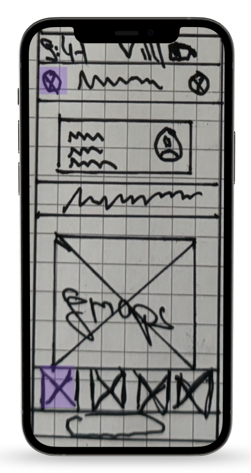
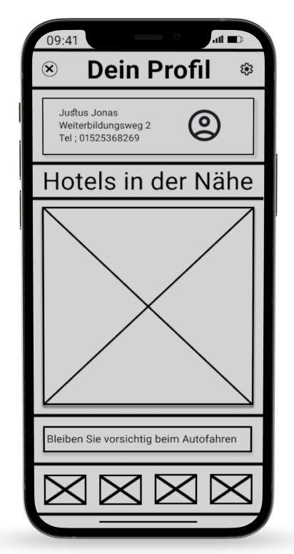
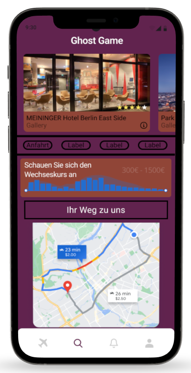

# Travel Me

**Did you already traveled Me?**

"Travel Me" is the app that makes your travel planning a breeze. It not only shows you the best flights to your desired destination, but also provides a selection of hotels that perfectly fit your budget and preferences. Whether you're booking a spontaneous weekend getaway or planning a longer trip – with "Travel Me," you'll always find the best deals in one place.

The app is perfect for travelers who want to make the most of their time without spending hours searching for the best prices and options. It combines flight and hotel bookings in a user-friendly interface, saving you valuable time. Compared to other apps, "Travel Me" is especially focused on simplicity and clear recommendations, allowing you to focus fully on your journey instead of dealing with overwhelming options.

## Design

  
  
  

## Features
**Here are all the features my app offers.**

- 🛩️ Show flights to desired destination
- 🏨 Display hotels matching budget and preferences
- ⌚️ Real-time pricing and availability updates
- 🛫 Filter options for flights (e.g., direct flights, layovers)
- 🏠 Filter options for hotels (e.g., price range, star rating, amenities)
- 🤓 User account creation for trip management
- 🙇‍♂️ Notifications for price drops or deals
- 🗺️ Integration with maps for nearby hotel locations

#### Project Structure
The project follows the MVVM (Model-View-ViewModel) architecture, which allows for a clean separation of concerns. The View handles the UI and user interaction, while the ViewModel holds the business logic and data processing. The Model is responsible for the data representation and API integration.

**Folder Structure:**
- /Models – Data models, such as Flight, Hotel, Booking.
- /Views – SwiftUI views, including screens like the flight search, hotel details, and booking confirmation.
- /ViewModels – Contains all the business logic for processing flight and hotel data.

#### Data Storage
I store user preferences (e.g., chosen destinations, filter settings) in Swift Data for offline-first functionality, ensuring a seamless experience even when the user is not connected to the internet. Data like flight and hotel searches, including real-time pricing, are retrieved from APIs and are temporarily stored in memory for faster access during the session.

#### API Calls
For this app, I'm using a single API to handle both flight and hotel data. I rely on the [**Amadeus IT Group SA**] API to retrieve real-time information about available flights and hotels based on user preferences.

#### 3rd-Party Frameworks
- Firebase for authentication and real-time notifications about price changes.
- Amadeus for Developers for tracking API calls 

## Outlook
-  Trip itinerary builder with flight, hotel, and acticity suggestions
-  Integration with a payment gateway for seamless booking
-  Social sharing features for itineraries and trips
-  Price prediction algorithm based on historical data to help users decide when to book
