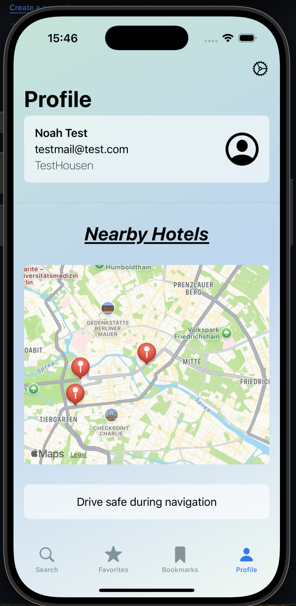

# Travel Me

**Did you already traveled Me?**

"Travel Me" is the app that makes your travel planning a breeze. When you search for a city, the app shows you a selection of hotels that perfectly match your budget and preferences. Whether it's for a spontaneous weekend getaway or a longer trip, with "Travel Me", you'll always find the best hotel deals in one place.

The app is ideal for travelers who want to make the most of their time without spending hours searching for the best prices and options. It offers a user-friendly interface that helps you quickly find the perfect hotels without being overwhelmed by too many choices. Compared to other apps, "Travel Me" focuses on simplicity and clear recommendations, allowing you to focus entirely on your journey.

## Design

  
  
  

## Features
**Here are all the features my app offers.**

- 🏨 Display hotels matching budget and preferences
- 🏠 Filter options for hotels (e.g., price range, star rating, amenities)
- 🤓 User account creation for trip management
- 🗺️ Integration with maps for nearby hotel locations

#### Project Structure
The project follows the MVVM (Model-View-ViewModel) architecture, which allows for a clean separation of concerns. The View handles the UI and user interaction, while the ViewModel holds the business logic and data processing. The Model is responsible for the data representation and API integration.

**Folder Structure:**
- /Models – Data models, such as Flight, Hotel, Booking.
- /Views – SwiftUI views, including screens like the flight search, hotel details, and booking confirmation.
- /ViewModels – Contains all the business logic for processing flight and hotel data.

#### Data Storage
I store user preferences (e.g., chosen destinations, filter settings) in Swift Data for offline-first functionality, ensuring a seamless experience even when the user is not connected to the internet. Data like hotel searches are retrieved from APIs and are temporarily stored in memory for faster access during the session.

#### API Calls
For this app, I’m using the Amadeus API to retrieve real-time information about available hotels in cities based on user preferences. This ensures that you always get the most up-to-date options that perfectly match your budget and needs.

Additionally, the Unsplash API is used to provide beautiful, high-quality photos of hotels, helping you get a better feel for your accommodation choices before booking.

#### 3rd-Party Frameworks
- Firebase for authentication and real-time notifications about price changes.
- Amadeus for Developers for tracking API calls
- Unsplash API for providing high-quality hotel images.

## Outlook
-  Trip itinerary builder with flight, hotel, and acticity suggestions
-  Integration with a payment gateway for seamless booking
-  Social sharing features for itineraries and trips
-  Price prediction algorithm based on historical data to help users decide when to book
